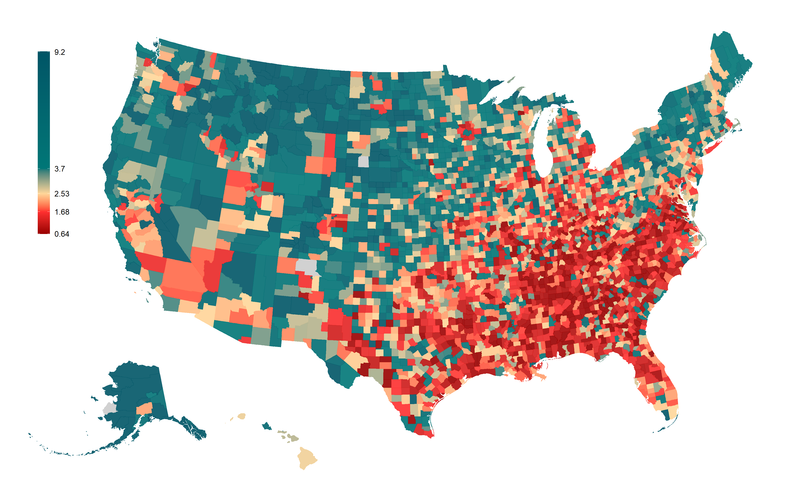
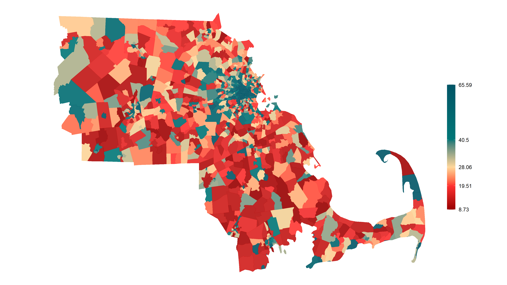
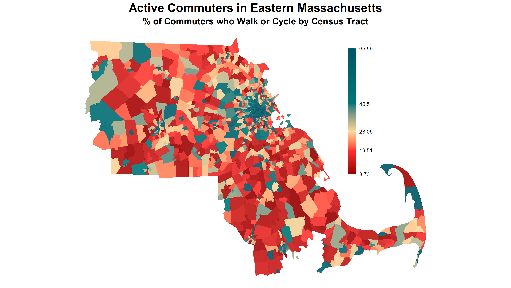

# smoov
This package intended smooths the process of mapping common objects like states, counties,
and census tracts. Mapping in R oftentimes involves multiple packages with varying syntaxes, leading
to downright ugly code, and downright ugly maps.
This package enables **s**imple **m**apping **o**f **o**ur **v**icinities.

For mapping purposes, this package relies heavily upon `ggplot2` while the actual
downloading of shapefiles is facilitated by the package `tigris`.

# Example

`smoov` makes maps  with sensible, visually appealing defaults for making maps
with United States Census geographies. I have a dataset in `data.table` format
called `county_commute` with three relevant variables:

* `state`: state FIPS code in integer format
* `county`: county FIPS code in integer format
* `active`: % of workers who commute by walking or cycling

In order to create a county-level map, this is all I need to do.

```r
dtc[, fips := create_fips(state, county)]
smoov("counties", data=dtc, value="active")
```



The first step uses `smoov::create_fips` and `data.table` syntax
to properly concatenate state and
county FIPS codes (or state, county, and tract codes), regardless of string
length. The second step plots at the level of `"counties` using the
column `"active"` in the dataset `dtc`.

Let's say I'm interested in tract-level data in eastern Massachusetts. To produce
such maps, this would usually require several slow, multi-line steps:

1. Load shapefile(s).
2. Merge shapefiles (tract shapefiles are often
   separated by state).
3. Merge tract-level data onto shapefiles.
4. Subset data appropriately.
5. Map
6. Modify map aesthetics

With `smoov` however, steps one through five&mdash;and parts of step six&mdash;are
simplified to _one line_.
First, the level of geography is provided with the `geo` parameter.
Next, optional subsetting takes place using state, county and tract
[FIPS](https://transition.fcc.gov/oet/info/maps/census/fips/fips.txt#:~:text=FIPS%20codes%20are%20numbers%20which,to%20which%20the%20county%20belongs.)
codes. 

```r
dtt[, fips := create_fips(state, county, tract)]
east_MA =  c(1,5,17,21,23,25,027)
bos = smoov(geo="tracts", data=dtt, value="active", states=25, counties=east_MA)
bos
```



The object produced by `smoov()` is simply a `ggplot2` object, so additional layers
can be added using the `ggplot2` syntax. In this case, I want to add a title, add
a subtitle, and reformat the legend.

```r
bos = bos +
  labs(title="Active Commuters in Eastern Massachusetts",
       subtitle="% of Commuters who Walk or Cycle by Census Tract") +
  theme(plot.title = element_text(size=20, face="bold", hjust = 0.5),
        plot.subtitle = element_text(size=15, face="bold", hjust = 0.5),
        legend.position=c(0.8,0.9),
        legend.justification=c(0.8, 0.9),
        legend.key.size = unit(1.5, "cm"),
        legend.key.width = unit(0.5,"cm"))
```



## Features

1. Reduces hassle
   * Automatically loads shapefiles from a faster `.rds` format
   * Automatically merges data values onto shapefile
2. Subsetting to specific geographies is fast and simple
3. Default aesthetics are optimized for visual clarity
   * Color gradient corresponds to specified quantiles of plotted values
   * Fill and border colors draw attention to the _differences_ between
   geometries rather than the _shape_ of geometries.
   * Automatically rescales Hawaii and Alaska when plotting entire USA
   * Automatically applies appropriate coordinate system depending
   on level of geography plotted
4. If you don't like the aesthetics, just use `ggplot2::theme`
and other `ggplot` layers like in the example above

## Instllation and Setup

It's easiest to install this package by running the following line of code in the R
console.

```r
devtools::install_github("harveybarnhard/smoov")
```

Before using `smoov`, the shapefiles must be downloaded and converted to .rds files for
efficient loading and use by `smoov` functions. The function `smoov_setup()` serves
just this purpose.

For reproducability, this step should be placed at the top of the project file where
you are loading all of your R packages, e.g.

```r
library(data.table)
library(smoov)
smoov_setup(load_mapfiles=TRUE)
```
